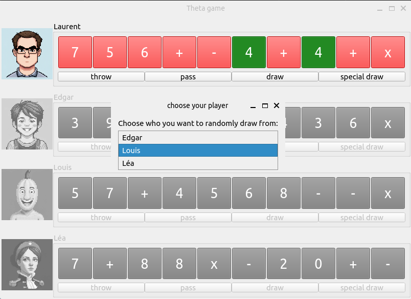
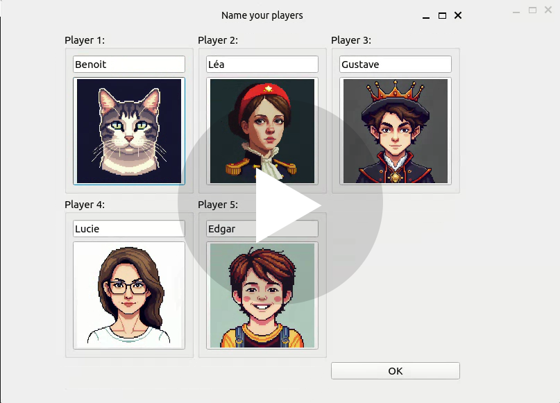
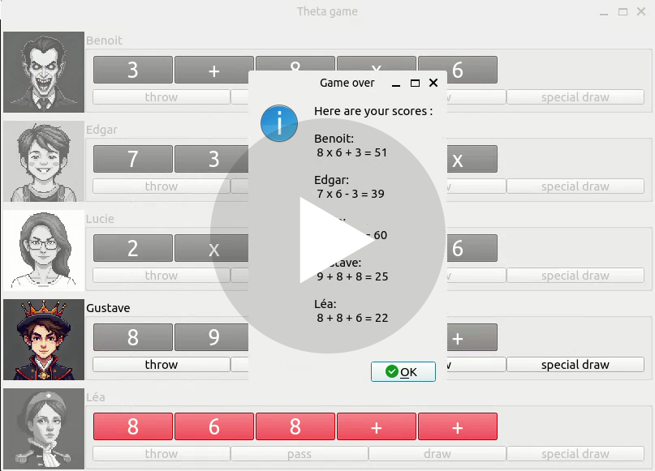

# THETA

Remember this project is still a work in progress.

## Presentation

Theta is a tool for testing ideas for a card game. It's not a game per se, but rather a way to simulate games and check if the rules are fun and well-balanced. 
It is also a means for me to practice building interfaces with PySide.

# Visuals

## Stard game :

[Download or Watch Video](resources/readme_medias/video_sart_game.webm)

## End game :

[Download or Watch Video](resources/readme_medias/video_end_game.webm)

## Game rules :

Theta is a card game for 2 to 5 players where the goal is to get rid of cards until you have only 5 left in your hand. At that point, you form a mathematical operation with those 5 cards to get the highest number possible. Players take turns discarding cards, passing them to others, drawing new cards, or performing a special draw to disrupt opponents' hands. The game ends when all players have only 5 cards left. Points are scored based on the mathematical operations formed, with penalties for extra or incorrect cards.

