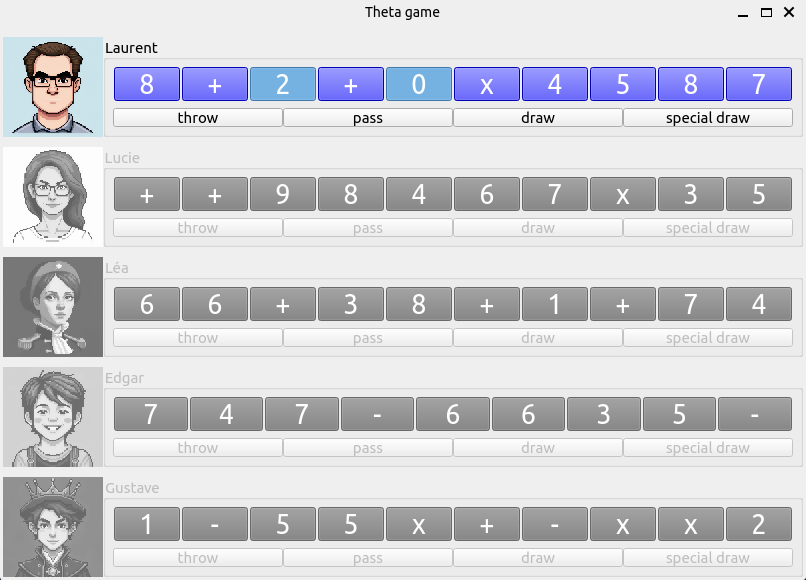
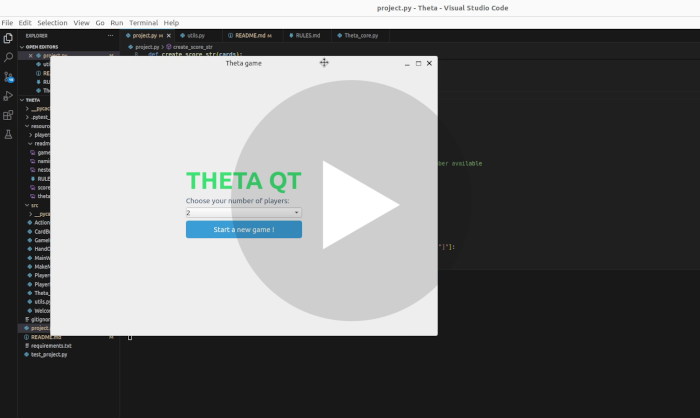
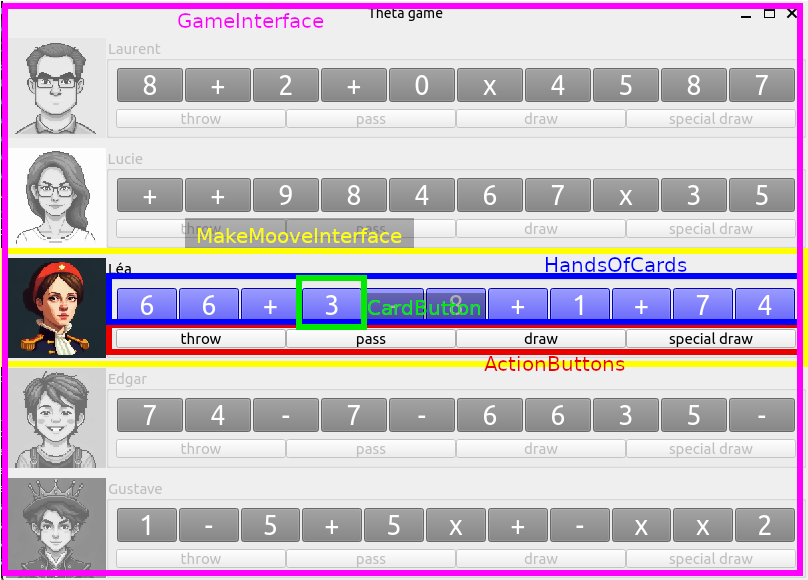
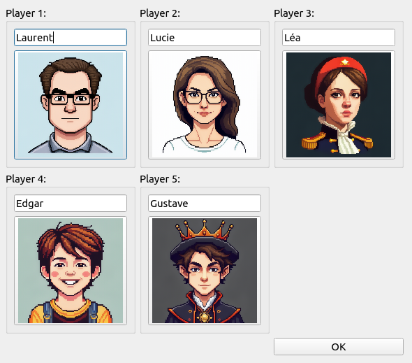
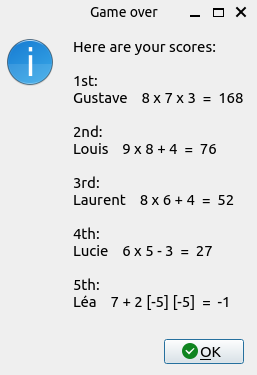
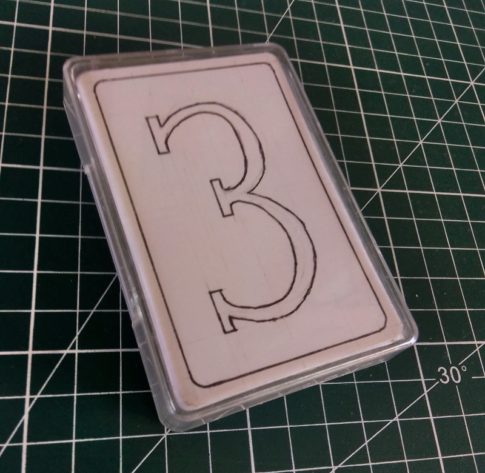

# THETA QT

## Presentation

ThetaQt is a tool for simulating a prototype card game imagined by a friend of mine. It's not a game per se, but rather a way to simulate games and check if the rules are fun and well-balanced. 
It also serves as a practice project for me to build interfaces with PyQt/PySide.



## Video Presentation for cs50

[](https://youtu.be/JPLNyniYB7U )

#### Video Demo link:  <https://youtu.be/JPLNyniYB7U >


## The game interface
Each part of the game interface is a custom subclass of QWidget. They are nested within each other, from the top-level 'MainWindow' to the smallest component, 'CardButton'.

```
MainWindow
    |- WelcomeScreen
    |- GameInterface
        |- MakeMoveInterface
            |- HandOfCards
                |- CardButtons
            |- ActionButtons
```



## Game rules

Theta is a card game for 2 to 5 players where the goal is to get rid of cards until you have only 5 left in your hand. At that point, you form a mathematical operation with those 5 cards to achieve the highest number possible. Players take turns discarding cards, passing them to others, drawing new cards, or performing a special draw to disrupt opponents' hands. The game ends when all players have only 5 cards left. Points are scored based on the mathematical operations formed, with penalties for extra or incorrect cards.

For the extended version of the rules, check :
[extended rules](resources/readme_medias/RULES.md)

## The players naming dialog window

After the welcome screen, where you choose how many players you want to simulate using a combo-box, you are taken to a dialog window where you can customize the player names and avatars. When clicked, the icons loop through a list of AI-generated pixel art avatars. By default, a selection of name-icon pairs matching my friends is randomly displayed.



## The gameover dialog window
When the game ends, you are presented with a final dialog window before being redirected to the title screen. Players are ranked by score, with the best possible mathematical operation from their final hand displayed. It is worth noting the rule: there is a penalty of -5 for each extra or incorrect card.



## Possible improvements

To further develop this project, I would like to:

- Add a menu bar with options to restart the game with the current players, return to the title screen, or quit.
- Include a dialog window with the game rules accessible from the menu.
- Add an option to hide the values of the cards of all non-active players.
- Save a JSON file with the names and associated icons of the last players who played the game.
- Add a status bar that provides a hint of what an action does when the cursor hovers over the action button.
- Provide a better visual cue for cards returning to a player's hand, possibly with animation or color changes.
- Develop an AI to play against the computer, making this project into a fully-fledged video game.

## First Physical Prototype

To end this presentation on a light note, here is a photo of the first paper prototype handcrafted by my friend:


